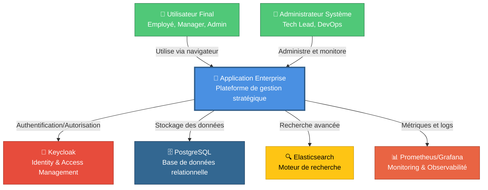
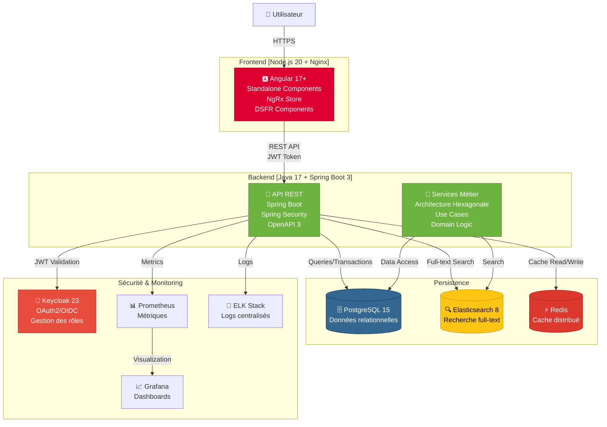
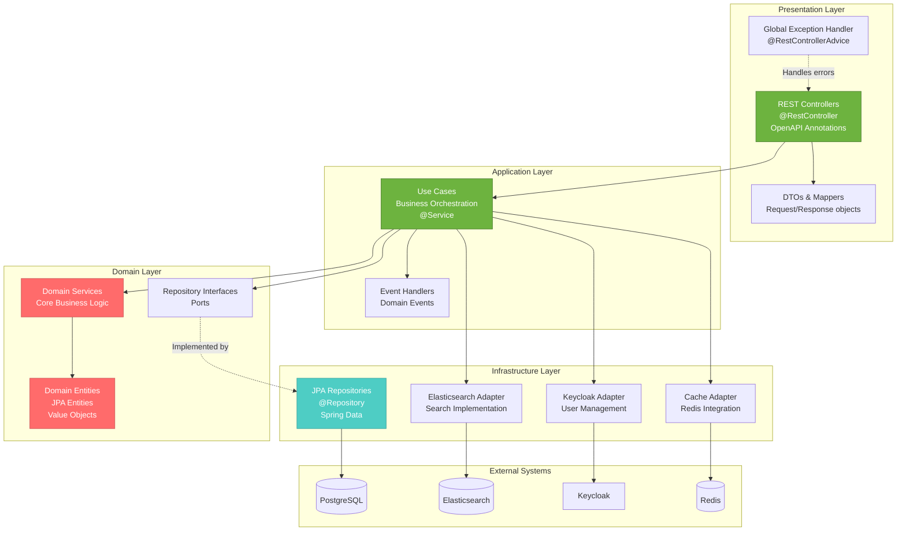
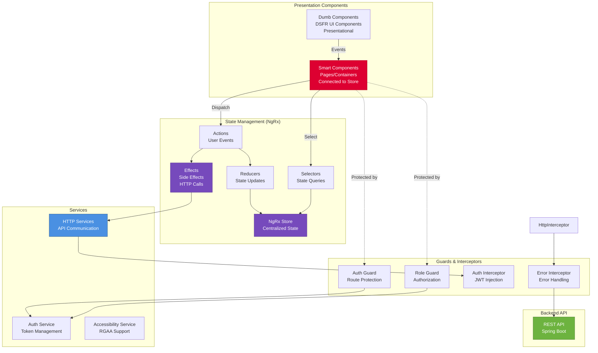
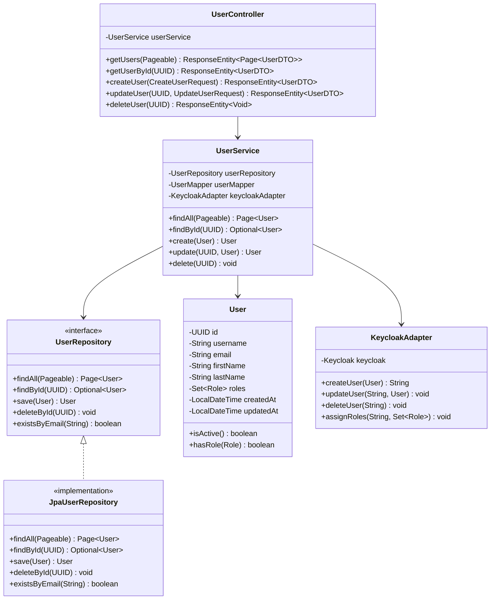
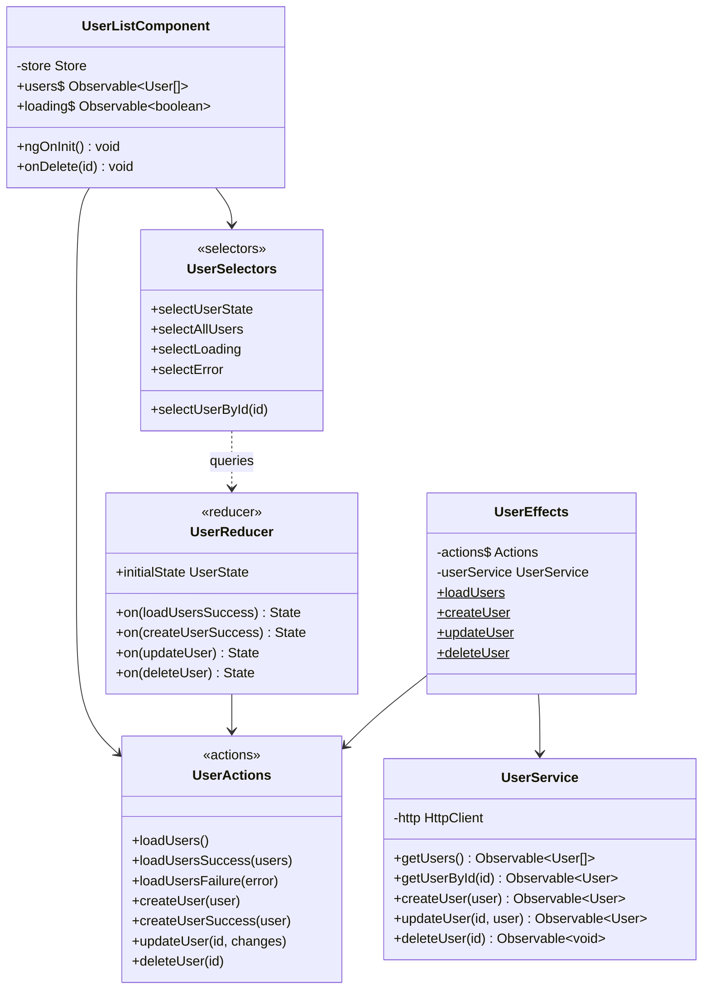
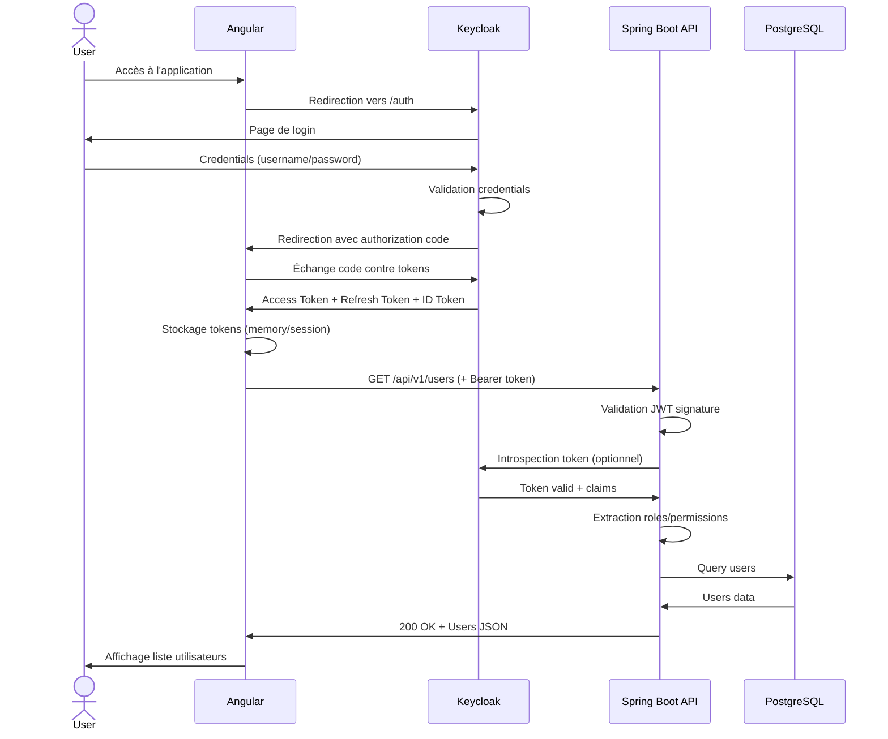
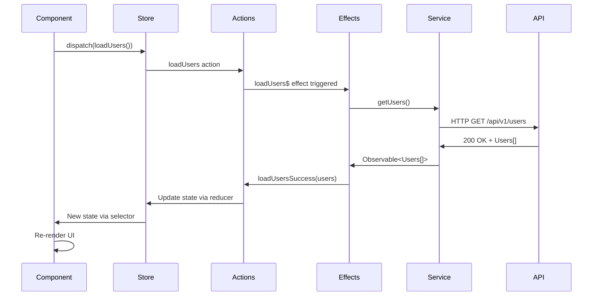
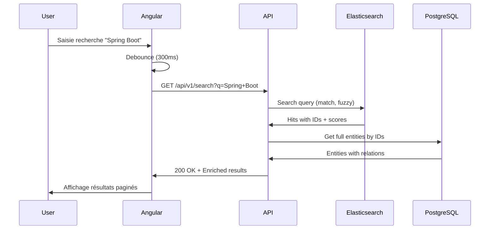
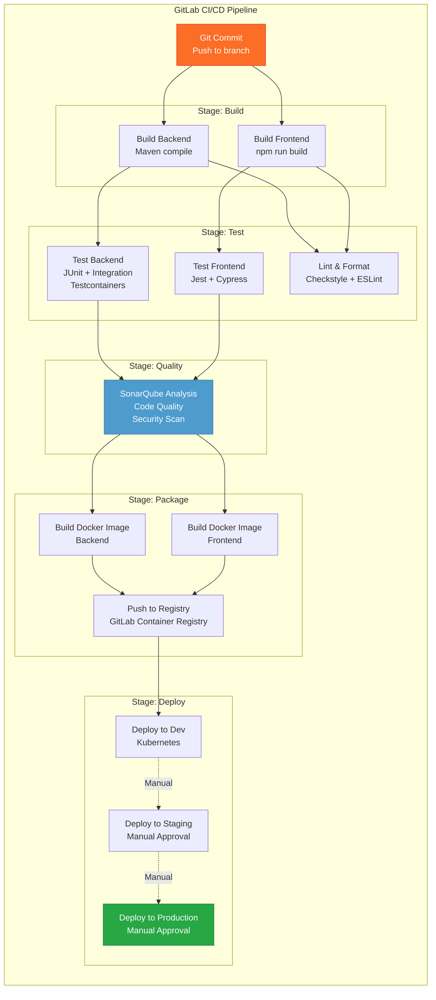

# Architecture C4 - Application Enterprise-Grade

## Vue d'ensemble

Ce document décrit l'architecture complète de l'application selon le modèle C4 (Context, Container, Component, Code).

---

## Niveau 1 : Diagramme de Contexte (Context)

Le diagramme de contexte montre comment le système interagit avec les utilisateurs et les systèmes externes.



**Acteurs :**
- **Utilisateurs finaux** : Employés, managers, administrateurs métier
- **Administrateurs système** : Tech Leads, DevOps, SRE

**Systèmes externes :**
- **Keycloak** : Gestion centralisée de l'authentification et des autorisations (OAuth2/OIDC)
- **PostgreSQL** : Base de données relationnelle principale
- **Elasticsearch** : Moteur de recherche pour requêtes complexes
- **Prometheus/Grafana** : Stack de monitoring et observabilité

---

## Niveau 2 : Diagramme de Conteneurs (Container)

Le diagramme de conteneurs décompose le système en conteneurs logiques (applications, services).



**Conteneurs principaux :**

### Frontend
- **Technologie** : Angular 17+ avec standalone components
- **État** : NgRx Store pour la gestion d'état centralisée
- **UI** : DSFR (Système de Design de l'État Français)
- **Accessibilité** : RGAA compliant
- **Déploiement** : Build optimisé servi par Nginx

### Backend
- **Technologie** : Spring Boot 3 + Java 17
- **Architecture** : Hexagonale (Ports & Adapters)
- **Sécurité** : Spring Security + OAuth2 Resource Server
- **API** : REST avec OpenAPI 3 (Swagger)
- **Résilience** : Resilience4j (Circuit Breaker, Rate Limiter)

### Persistence
- **PostgreSQL** : Base de données principale (ACID)
- **Elasticsearch** : Recherche full-text et analytics
- **Redis** : Cache distribué et sessions

---

## Niveau 3 : Diagramme de Composants (Component)

### 3.1 Composants Backend (Architecture Hexagonale)



**Couches de l'architecture hexagonale :**

1. **Presentation (Adapters)** : Controllers REST, DTOs, Exception handlers
2. **Application** : Use cases, orchestration, coordination
3. **Domain (Core)** : Logique métier, entités, value objects, interfaces
4. **Infrastructure (Adapters)** : Implémentations concrètes (DB, Search, Cache)

### 3.2 Composants Frontend (Angular)



**Composants clés :**

1. **Smart Components** : Pages connectées au store NgRx
2. **Dumb Components** : Composants DSFR réutilisables
3. **NgRx Store** : Gestion d'état centralisée (Actions, Reducers, Effects, Selectors)
4. **Services HTTP** : Communication avec le backend
5. **Guards** : Protection des routes (authentification, rôles)
6. **Interceptors** : Injection JWT, gestion d'erreurs

---

## Niveau 4 : Diagramme de Code (Code)

### 4.1 Exemple : Architecture d'un Use Case Backend



### 4.2 Exemple : NgRx Store pour les Users (Frontend)



---

## Flux de données complets

### Flux d'authentification OAuth2/OIDC



### Flux CRUD avec NgRx



### Flux de recherche Elasticsearch



---

## Architecture de déploiement (Kubernetes)

```mermaid
graph TB
    subgraph "Kubernetes Cluster"
        subgraph "Ingress"
            Ingress[Nginx Ingress Controller<br/>TLS Termination<br/>Rate Limiting]
        end

        subgraph "Frontend Namespace"
            FrontPod1[Angular Pod 1<br/>Nginx]
            FrontPod2[Angular Pod 2<br/>Nginx]
            FrontService[Frontend Service<br/>ClusterIP]
        end

        subgraph "Backend Namespace"
            BackPod1[Spring Boot Pod 1<br/>Java 17]
            BackPod2[Spring Boot Pod 2<br/>Java 17]
            BackPod3[Spring Boot Pod 3<br/>Java 17]
            BackService[Backend Service<br/>ClusterIP]
        end

        subgraph "Data Namespace"
            PostgresPod[PostgreSQL StatefulSet<br/>Primary + Replicas]
            RedisPod[Redis StatefulSet<br/>Cluster Mode]
            ElasticPod[Elasticsearch StatefulSet<br/>3 nodes cluster]
        end

        subgraph "Security Namespace"
            KeycloakPod[Keycloak StatefulSet<br/>HA Mode]
        end

        subgraph "Monitoring Namespace"
            PrometheusPod[Prometheus<br/>Metrics Storage]
            GrafanaPod[Grafana<br/>Dashboards]
            ElkPod[ELK Stack<br/>Centralized Logs]
        end

        subgraph "Persistent Storage"
            PV1[PersistentVolume<br/>PostgreSQL Data]
            PV2[PersistentVolume<br/>Elasticsearch Data]
            PV3[PersistentVolume<br/>Redis Data]
        end
    end

    Internet[🌐 Internet] --> Ingress

    Ingress -->|/| FrontService
    Ingress -->|/api| BackService

    FrontService --> FrontPod1
    FrontService --> FrontPod2

    BackService --> BackPod1
    BackService --> BackPod2
    BackService --> BackPod3

    BackPod1 --> PostgresPod
    BackPod2 --> PostgresPod
    BackPod3 --> PostgresPod

    BackPod1 --> RedisPod
    BackPod2 --> RedisPod
    BackPod3 --> RedisPod

    BackPod1 --> ElasticPod
    BackPod2 --> ElasticPod
    BackPod3 --> ElasticPod

    BackPod1 --> KeycloakPod
    BackPod2 --> KeycloakPod
    BackPod3 --> KeycloakPod

    PostgresPod --> PV1
    ElasticPod --> PV2
    RedisPod --> PV3

    BackPod1 -.->|Metrics| PrometheusPod
    BackPod2 -.->|Metrics| PrometheusPod
    BackPod3 -.->|Metrics| PrometheusPod

    PrometheusPod --> GrafanaPod

    BackPod1 -.->|Logs| ElkPod
    BackPod2 -.->|Logs| ElkPod
    BackPod3 -.->|Logs| ElkPod

    style Ingress fill:#00BCD4,stroke:#0097A7,color:#fff
    style FrontPod1 fill:#DD0031,stroke:#B00020,color:#fff
    style FrontPod2 fill:#DD0031,stroke:#B00020,color:#fff
    style BackPod1 fill:#6DB33F,stroke:#4A7C2F,color:#fff
    style BackPod2 fill:#6DB33F,stroke:#4A7C2F,color:#fff
    style BackPod3 fill:#6DB33F,stroke:#4A7C2F,color:#fff
```

**Caractéristiques clés :**
- **Haute disponibilité** : Réplication des pods (3 replicas backend)
- **Load balancing** : Service Kubernetes avec distribution automatique
- **Persistent storage** : StatefulSets pour données critiques
- **Isolation** : Namespaces par couche applicative
- **Monitoring** : Prometheus + Grafana intégrés
- **Logs** : Centralisation avec ELK Stack

---

## Pipeline CI/CD GitLab



**Étapes du pipeline :**
1. **Build** : Compilation backend (Maven) et frontend (npm)
2. **Test** : Tests unitaires, intégration, E2E, linting
3. **Quality** : Analyse SonarQube (code smells, vulnerabilités, coverage)
4. **Package** : Build images Docker multi-stage
5. **Deploy** : Déploiement automatique en dev, manuel en staging/prod

---

## Décisions architecturales clés

### ADR 001 : Architecture Hexagonale
- **Décision** : Adopter l'architecture hexagonale pour le backend
- **Raison** : Indépendance de la logique métier vis-à-vis de l'infrastructure
- **Conséquence** : Meilleure testabilité, maintenabilité, évolutivité

### ADR 002 : Standalone Components Angular
- **Décision** : Utiliser exclusivement les standalone components
- **Raison** : Recommandation officielle Angular 17+, simplification
- **Conséquence** : Moins de boilerplate, lazy loading simplifié

### ADR 003 : NgRx pour la gestion d'état
- **Décision** : NgRx Store comme solution de state management
- **Raison** : Prévisibilité, DevTools, écosystème mature
- **Conséquence** : Courbe d'apprentissage, mais scalabilité garantie

### ADR 004 : Keycloak pour l'IAM
- **Décision** : Keycloak comme Identity Provider
- **Raison** : Open-source, support OAuth2/OIDC, SSO, gestion des rôles
- **Conséquence** : Configuration initiale complexe, mais sécurité renforcée

### ADR 005 : Kubernetes comme orchestrateur
- **Décision** : Déploiement sur Kubernetes
- **Raison** : Scalabilité horizontale, self-healing, écosystème riche
- **Conséquence** : Complexité opérationnelle, mais production-ready

---

## Matrice de responsabilités (RACI)

| Composant | Tech Lead | Senior Backend | Senior Frontend | Intermédiaire | Junior |
|-----------|-----------|----------------|-----------------|---------------|--------|
| Architecture globale | **R/A** | C | C | I | I |
| Spring Security + Keycloak | C | **R/A** | I | C | I |
| Architecture hexagonale | **R/A** | **R** | I | C | I |
| API REST + OpenAPI | C | **R/A** | C | C | I |
| NgRx Store | C | I | **R/A** | C | C |
| DSFR Components | I | I | **R/A** | **R** | C |
| Tests unitaires | C | **R/A** | **R/A** | **R** | **R** |
| GitLab CI/CD | **R/A** | C | C | I | I |
| Kubernetes | **R/A** | C | C | I | I |
| Documentation | **A** | **R** | **R** | **R** | C |

**Légende :**
- **R** : Responsible (Réalise)
- **A** : Accountable (Responsable final)
- **C** : Consulted (Consulté)
- **I** : Informed (Informé)

---

## Métriques de qualité

### Objectifs de qualité

| Métrique | Objectif | Mesure |
|----------|----------|--------|
| Couverture de code | > 80% | JaCoCo + Jest |
| Code smells | < 50 | SonarQube |
| Bugs critiques | 0 | SonarQube |
| Vulnérabilités | 0 | SonarQube + Dependabot |
| Duplications | < 3% | SonarQube |
| Complexité cyclomatique | < 10 | SonarQube |
| Performance API (p95) | < 200ms | Prometheus |
| Disponibilité | > 99.9% | Prometheus |
| Build time | < 10 min | GitLab CI/CD |

---

## Prochaines étapes

1. ✅ Architecture C4 définie
2. ⏭️ Création de la structure de projet
3. ⏭️ Implémentation backend (Spring Boot)
4. ⏭️ Implémentation frontend (Angular)
5. ⏭️ Configuration infrastructure (Docker, K8s)
6. ⏭️ Pipeline CI/CD
7. ⏭️ Documentation technique
8. ⏭️ Plan de charge Tech Lead
