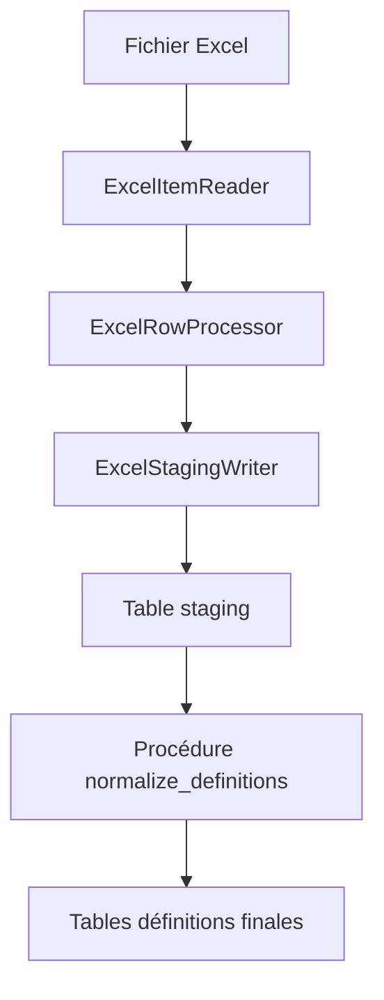
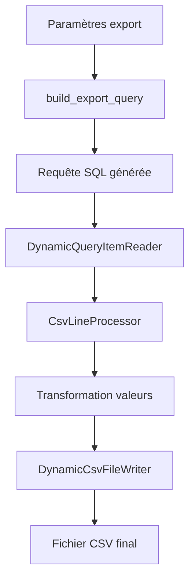

# Architecture du Système d'Export CSV

## Vue d'ensemble

Le système d'export CSV permet de générer automatiquement des fichiers CSV personnalisés à partir des données de questionnaires stockées en PostgreSQL. Il sépare clairement la **définition métier** (gérée via Excel par les fonctionnels) de l'**implémentation technique** (gérée par les développeurs via PostgreSQL).

## Principe de Fonctionnement

### 1. Séparation Métier / Technique

```
┌─────────────────────┐    ┌──────────────────────────┐
│   DICTIONNAIRE      │    │    MAPPING TECHNIQUE     │
│   MÉTIER (Excel)    │    │    (PostgreSQL)          │
├─────────────────────┤    ├──────────────────────────┤
│ • code_variable     │◄──►│ • code_variable          │
│ • libelle          │    │ • source_table           │
│ • format           │    │ • source_column          │
│ • type_question    │    │ • sql_expression         │
│ • regle_gestion    │    │ • join_tables            │
│ • valeur_possible  │    │                          │
└─────────────────────┘    └──────────────────────────┘
```

### 2. Préservation de l'Ordre

**CRUCIAL** : L'ordre des lignes dans l'Excel détermine l'ordre des colonnes dans le CSV final.

```
Excel:              CSV Final:
Ligne 2: Q_ID   →   Q_ID;Q_SEXE;Q_EMAIL;Q_VILLE
Ligne 3: Q_SEXE →   12345;1;jean@test.com;Paris
Ligne 4: Q_EMAIL→   54321;2;marie@test.com;Lyon
Ligne 5: Q_VILLE
```

## Architecture Technique

### Schéma PostgreSQL

```sql
export_csv/
├── excel_csv_definition_stg     -- Staging Excel
├── csv_column_definition        -- Définitions métier
├── csv_column_values           -- Valeurs possibles
├── column_sql_mapping          -- Mapping technique
├── join_definition             -- Définitions de jointures
├── export_execution            -- Tracking des exports
└── v_complete_column_definition -- Vue combinée
```

### Composants Spring Boot

```
com.enterprise.app/
├── domain/
│   ├── model/csvexport/
│   │   ├── CsvColumnDefinition.java
│   │   ├── CsvColumnValues.java
│   │   ├── ColumnSqlMapping.java
│   │   ├── ExcelDefinitionStaging.java
│   │   └── ExportExecution.java
│   └── repository/csvexport/
├── infrastructure/
│   ├── batch/csvexport/
│   │   ├── ExcelItemReader.java           -- Lecture Excel avec ordre
│   │   ├── ExcelRowProcessor.java         -- Traitement lignes
│   │   ├── DynamicQueryItemReader.java    -- Exécution requête générée
│   │   ├── CsvLineProcessor.java          -- Transformation valeurs
│   │   ├── DynamicCsvFileWriter.java      -- Écriture CSV
│   │   └── *JobConfiguration.java         -- Configuration Batch
│   └── scheduler/
│       └── CsvExportScheduler.java        -- Exports automatiques
├── application/service/csvexport/
│   ├── CsvExportService.java
│   └── ExcelImportService.java
└── presentation/controller/v1/
    └── CsvExportController.java
```

## Workflow Complet

### 1. Import Excel → PostgreSQL



### 2. Export PostgreSQL → CSV



## Configuration et Utilisation

### Variables d'Environnement

```yaml
# application.yml
app:
  csv-export:
    default-output-directory: ${CSV_EXPORT_OUTPUT_DIR:/tmp/csv-exports}
    scheduler:
      enabled: ${CSV_EXPORT_SCHEDULER_ENABLED:true}
    performance:
      chunk-size: ${CSV_EXPORT_CHUNK_SIZE:500}
```

### API REST

```bash
# Import Excel
POST /api/v1/csv-export/import-excel
Content-Type: multipart/form-data
file: definitions.xlsx

# Export CSV
POST /api/v1/csv-export/export
?nomCsv=CSV_1&dateDebut=2024-01-01&dateFin=2024-01-31

# Export hebdomadaire automatique
POST /api/v1/csv-export/export/weekly

# Statut d'export
GET /api/v1/csv-export/status/{jobExecutionId}
```

### Scheduler Automatique

```java
@Scheduled(cron = "0 0 2 ? * MON", zone = "Europe/Paris")
public void weeklyExport() {
    csvExportService.exportAllCsvsHebdomadaire();
}
```

## Exemples de Mapping Technique

### 1. Mapping Simple

```sql
INSERT INTO export_csv.column_sql_mapping VALUES
('Q_SEXE', 'personne', 'sexe', null, ARRAY['personne']);

-- Génère: p.sexe AS Q_SEXE
```

### 2. Mapping Complexe

```sql
INSERT INTO export_csv.column_sql_mapping VALUES
('Q_NB_FORMATIONS', null, null,
 '(SELECT COUNT(*) FROM formation_participation fp WHERE fp.questionnaire_id = q.id)');

-- Génère: (SELECT COUNT(*) FROM formation_participation fp WHERE fp.questionnaire_id = q.id) AS Q_NB_FORMATIONS
```

### 3. Transformation des Valeurs

```java
// Règle: POSITION_VALEUR_POSSIBLE
// Valeurs possibles: ["Homme", "Femme", "Autre"]
// Résultat: "Homme" → "1", "Femme" → "2", "Autre" → "3"

// Règle: TEXTE_DIRECT
// Résultat: valeur inchangée

// Règle: NUMERIQUE_DIRECT
// Résultat: valeur inchangée

// Règle: DATE_ISO
// Résultat: formatage YYYY-MM-DD
```

## Points Critiques

### ✅ Préservation de l'Ordre
- L'ordre Excel est préservé via `excel_row_number`
- La colonne `ordre_colonne` est calculée avec `ROW_NUMBER() OVER (ORDER BY excel_row_number)`
- Les requêtes utilisent `ORDER BY ordre_colonne` pour garantir l'ordre final

### ✅ Performance
- Chunk size configurables (Excel: 50, CSV: 500)
- Curseurs PostgreSQL pour les gros volumes
- Index optimisés sur les tables de métadonnées

### ✅ Robustesse
- Tracking complet des exports (`export_execution`)
- Gestion d'erreur et retry des jobs Spring Batch
- Monitoring automatique des exports qui traînent

### ✅ Maintenabilité
- Séparation claire métier/technique
- Fonction PostgreSQL pour génération de requête dynamique
- Tests unitaires et d'intégration complets

## Tests

### Tests Unitaires
```bash
# Entités et logique métier
./mvnw test -Dtest=*csvexport*Test

# Tests d'intégration
./mvnw test -Dtest=CsvExportSystemIntegrationTest
```

### Tests de Performance
```bash
# Export avec 10K questionnaires, 500 colonnes
# Objectif: < 5 minutes
```

## Critères de Succès

✅ Import d'un fichier Excel avec 500 colonnes en < 30 secondes
✅ Export de 10 000 questionnaires avec 500 colonnes en < 5 minutes
✅ L'ordre des colonnes CSV respecte EXACTEMENT l'ordre Excel
✅ Exports automatiques chaque lundi à 2h du matin
✅ Ajout d'une colonne simple = modification Excel uniquement
✅ Ajout d'une colonne complexe = Excel + 1 ligne SQL de mapping
✅ Logs détaillés et tracking complet
✅ Tests unitaires avec couverture > 90%

## Maintenance

### Ajouter une Nouvelle Colonne Simple
1. Ajouter la ligne dans l'Excel
2. Ajouter le mapping SQL :
```sql
INSERT INTO export_csv.column_sql_mapping VALUES
('Q_NOUVELLE_COLONNE', 'table_source', 'colonne_source', ARRAY['joins_requis']);
```

### Ajouter une Nouvelle Colonne Complexe
1. Ajouter la ligne dans l'Excel
2. Ajouter le mapping SQL avec expression :
```sql
INSERT INTO export_csv.column_sql_mapping VALUES
('Q_CALCUL_COMPLEXE', null, null, '(expression SQL complexe)');
```

### Monitoring
- Logs dans `export_execution`
- Métriques Spring Boot Actuator
- Alerting si export > 1h
- Nettoyage automatique tous les dimanches