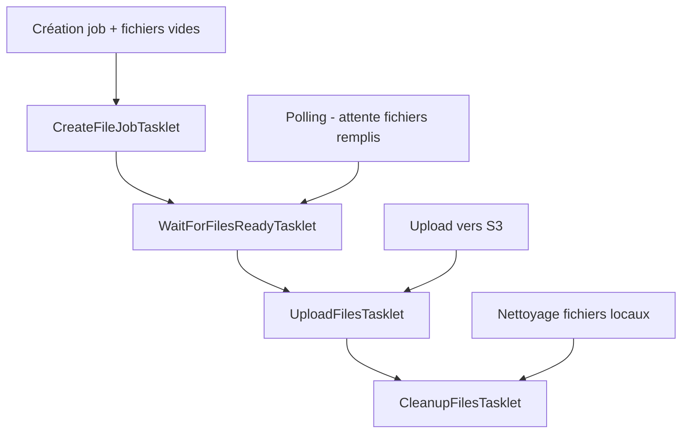

# Intégration Spring Batch avec FileWorkflowManager

## Vue d'ensemble

Ce document décrit l'implémentation d'une intégration complète entre Spring Batch et le `FileWorkflowManager` existant. L'objectif est de créer un workflow de traitement de fichiers robuste et scalable utilisant les capacités de Spring Batch pour la gestion des jobs, la reprise d'erreurs, et le monitoring.

## Architecture

### Composants principaux

1. **BatchConfiguration** : Active Spring Batch dans l'application
2. **FileWorkflowJobConfiguration** : Définit le job Spring Batch et ses étapes
3. **Tasklets** : Implémentent chaque étape du workflow
4. **FileWorkflowBatchService** : Service d'application pour lancer et monitorer les jobs
5. **Tests** : Tests unitaires et d'intégration complets

### Workflow en 4 étapes



## Implémentation détaillée

### 1. Configuration Spring Batch

**BatchConfiguration.java**
```java
@Configuration
@EnableBatchProcessing
public class BatchConfiguration {
    // Active Spring Batch avec configuration automatique
}
```

### 2. Tasklets du workflow

#### CreateFileJobTasklet
- **Rôle** : Initialise un nouveau job avec fichiers vides
- **Paramètres d'entrée** : `projectName`, `fileNames` (via JobParameters)
- **Sortie** : `fileJobId` dans l'ExecutionContext

#### WaitForFilesReadyTasklet
- **Rôle** : Attend que les fichiers soient remplis par un processus externe
- **Logique** : Polling avec 30 tentatives max, 2s entre chaque vérification
- **Gestion d'erreur** : Exception si timeout atteint

#### UploadFilesTasklet
- **Rôle** : Upload tous les fichiers vers S3
- **Sortie** : `uploadedS3Keys` dans l'ExecutionContext

#### CleanupFilesTasklet
- **Rôle** : Supprime les fichiers locaux temporaires
- **Finalisation** : Marque le job comme terminé avec succès

### 3. Configuration du Job

**FileWorkflowJobConfiguration.java**
```java
@Bean
public Job fileWorkflowJob(JobRepository jobRepository,
                          Step createFileJobStep,
                          Step waitForFilesReadyStep,
                          Step uploadFilesStep,
                          Step cleanupFilesStep) {
    return new JobBuilder("fileWorkflowJob", jobRepository)
            .start(createFileJobStep)
            .next(waitForFilesReadyStep)
            .next(uploadFilesStep)
            .next(cleanupFilesStep)
            .build();
}
```

### 4. Service d'application

**FileWorkflowBatchService.java**

Fonctionnalités :
- `launchFileWorkflowJob()` : Lance un job de manière synchrone
- `launchFileWorkflowJobAsync()` : Lance un job de manière asynchrone
- `getJobExecutionStatus()` : Récupère le statut d'une exécution
- `getJobExecutionSummary()` : Récupère un résumé détaillé

## Utilisation

### Lancement d'un job

```java
@Autowired
private FileWorkflowBatchService batchService;

public void processFiles() {
    String projectName = "mon-projet";
    Set<String> fileNames = Set.of("data.csv", "config.json", "report.txt");

    JobExecution execution = batchService.launchFileWorkflowJob(projectName, fileNames);

    if (execution.getStatus() == BatchStatus.COMPLETED) {
        String uploadedKeys = execution.getExecutionContext().getString("uploadedS3Keys");
        log.info("Fichiers uploadés : {}", uploadedKeys);
    }
}
```

### Monitoring

```java
Long jobExecutionId = execution.getId();
BatchStatus status = batchService.getJobExecutionStatus(jobExecutionId);
String summary = batchService.getJobExecutionSummary(jobExecutionId);
```

## Paramètres du job

| Paramètre | Type | Description | Exemple |
|-----------|------|-------------|---------|
| `projectName` | String | Nom du projet | "reporting-q4" |
| `fileNames` | String | Noms des fichiers séparés par virgule | "data.csv,summary.txt" |
| `timestamp` | String | Timestamp pour unicité | "20241227-143025" |

## Gestion d'erreurs

### Types d'erreurs gérées

1. **Paramètres manquants** : `IllegalArgumentException`
2. **Fichiers non prêts** : `RuntimeException` après timeout
3. **Échec upload S3** : `RuntimeException` avec rollback
4. **Échec cleanup** : `RuntimeException`

### Stratégie de reprise

- **Jobs échoués** : Peuvent être relancés avec les mêmes paramètres
- **Timeout fichiers** : Augmenter `MAX_WAIT_ATTEMPTS` ou `WAIT_INTERVAL_MS`
- **Échec S3** : Vérifier configuration AWS et permissions

## Tests

### Tests unitaires

Chaque Tasklet dispose de tests unitaires complets :
- `CreateFileJobTaskletTest` : Tests création job et validation paramètres
- `WaitForFilesReadyTaskletTest` : Tests polling et gestion timeout
- `UploadFilesTaskletTest` : Tests upload S3 et gestion erreurs
- `CleanupFilesTaskletTest` : Tests nettoyage et finalisation

### Tests d'intégration

- `FileWorkflowBatchIntegrationTest` : Tests du workflow complet
- `FileWorkflowBatchServiceTest` : Tests du service d'application

### Couverture de tests

- ✅ Cas nominaux (workflow complet)
- ✅ Gestion des erreurs à chaque étape
- ✅ Validation des paramètres
- ✅ Tests de timeout
- ✅ Tests d'intégration bout en bout

## Avantages de cette approche

### 1. **Robustesse**
- Gestion transactionnelle automatique
- Reprise d'erreurs intégrée
- Logging et monitoring natifs

### 2. **Scalabilité**
- Exécution parallèle de multiple jobs
- Configuration de pool de threads
- Monitoring via Spring Boot Actuator

### 3. **Maintenabilité**
- Séparation claire des responsabilités
- Tests unitaires et d'intégration complets
- Configuration externalisée

### 4. **Intégration**
- Réutilise le `FileWorkflowManager` existant
- Compatible avec l'architecture hexagonale
- Intégration Spring Boot native

## Configuration requise

### Dépendances Maven

```xml
<dependency>
    <groupId>org.springframework.boot</groupId>
    <artifactId>spring-boot-starter-batch</artifactId>
</dependency>
```

### Propriétés d'application

```yaml
spring:
  batch:
    job:
      enabled: false  # Désactive le lancement automatique
    jdbc:
      initialize-schema: always  # Crée les tables batch
```

### Base de données

Spring Batch nécessite des tables pour stocker les métadonnées des jobs. Elles sont créées automatiquement si `initialize-schema: always` est configuré.

## Monitoring et observabilité

### Métriques Spring Boot

- Job executions count
- Job duration
- Step execution metrics
- Failure rates

### Endpoints Actuator

- `/actuator/health` : Health check incluant batch status
- `/actuator/metrics` : Métriques détaillées des jobs
- `/actuator/info` : Informations sur les jobs configurés

## Extensions possibles

### 1. **Interface REST**
Créer un controller REST pour lancer et monitorer les jobs via API.

### 2. **Scheduling**
Intégrer avec `@Scheduled` pour des exécutions périodiques.

### 3. **Notifications**
Ajouter des notifications (email, Slack) en cas de succès/échec.

### 4. **Dashboard**
Créer un dashboard de monitoring avec Spring Boot Admin.

## Conclusion

Cette intégration fournit une base robuste pour le traitement de fichiers via Spring Batch, en s'appuyant sur le `FileWorkflowManager` existant. Elle offre une gestion d'erreurs avancée, un monitoring complet, et une architecture scalable adaptée aux besoins entreprise.

L'implémentation respecte les bonnes pratiques Spring Batch et maintient la compatibilité avec l'architecture hexagonale existante.